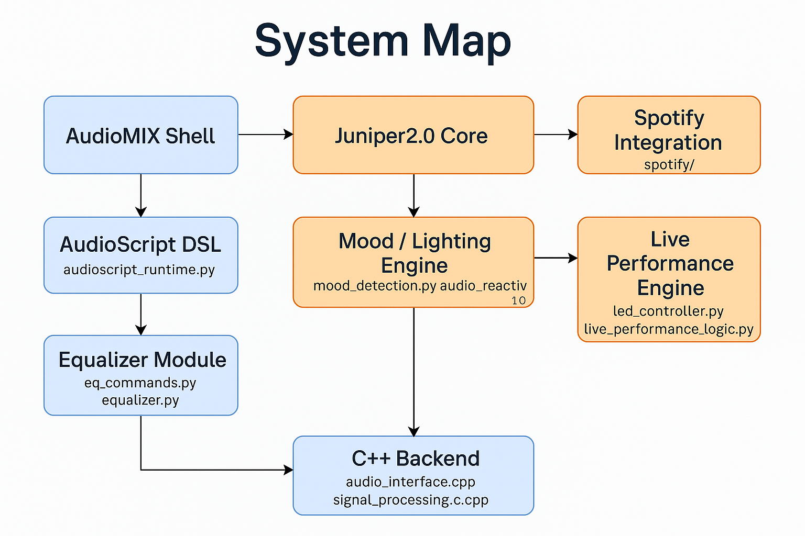

# 🎧  AudioMIX - AI-Assisted Modular Music Production Software for Independent Artists & Creators 
---

Meet **AudioMIX** - an open-source and intelligent artist-friendly digital audio workstation. **AudioMIX** features AI-powered audio analysis and mood-aware music interaction.
Spotibot was its original name.

**Modular, expressive, and built for real-time creative performance.**---

I update this repo continuously via my local terminal. :)

---

## Features
- Mood detection from audio files
- Spectral + MFCC-based analysis
- Integrated Spotify API for playlist input with room for future extensions
- Spotify integration: import playlists, analyze mood tracks, collaborative
- LED output logic for physical interaction
- Modular codebase (using Python + C/C++ + AudioScript (custom DSL))
- **Live performance engine** for real-time interaction and show control
- **Audience listener** to hype up live performances based on audience input
- **AudioScript Shell** for live coding features
- **CLI-parseable JSON output** for mood + BPM classification
- Built with independent artists in mind

---

## Ethical AI
**AudioMIX** follows an open-source, emotionally-aware, and artist-first development philosophy.  
See [ETHICAL_AI_MANIFESTO.md](./ETHICAL_AI_MANIFESTO.md) for our creative mission and guiding principles.

---

## License
GNU General Public License v3 (open-source and free to use for indie artists, please refer to LICENSE.txt)

---

## Project Modules
**AudioMIX** is modular by design, allowing for rapid extension into a full-scale music AI and production framework. The system will be organized into the following key components:

### 1. audio/extraction.py
**Purpose:** Feature extraction from audio files
**Current Capabilities:**
- Mel-frequency cepstal coefficients (MFCC)
- Spectral contrast
- Tempo + beat tracking
**Future Expansion:**
- Key detection
- Genre classification
- Dynamic range + loudness modeling

---

### 2. audio/mood_classifier.py
**Purpose:** Analyze extracted features and assign mood tags
**Current Capabilities:**
- Basic SVM model trained on open-label audio sets
- Custom mood categories: happy, calm, energetic, sad, relaxed, angry
**Future Expansion:**
- Neural network mood embedding
- Mood-to-mixtrack recommendation
- Personalized training datasets

---

### 3. audio/main.cpp + audio_utils.h + pulseaudio_oss.sh + led_response.cpp
**Purpose:** Real-time audio playback + mood-responsive LED control
**Current Capabilities:**
- C++ PortAudio-based playback 
- Shell script to manage audio routing for PortAudio
- GPIO/LED trigger on classification results
**Future Expansion:**
- Reactive visual patterns
- BPM-sync lighting
- Live mode for DJ controller input

---

### 4. datasets/
**Purpose:** Audio files, metadata, and ML training targets
**Current Format:**
- Metadata syncing with Spotify API
- Manual labeling for mood, BPM, genre
- JSON parsing logic per track
**Future Expansion:**
- CSV per track
- Open contributor mood tag dataset
- Dataset visualizer UI

---

### 5. led-service/
**Purpose:** LED control microservice for live color pattern output based on mood/BPM JSON input  
**Current Capabilities:**
- CLI-parseable JSON endpoint (e.g. `python main.py '{"mood": "hype", "bpm": 135}'`)
- Pattern selection (strobe, pulse, fade)
- Mood → RGB mapping with custom color profiles  
**Future Expansion:**
- Socket-based live trigger events
- DMX lighting integration for venue-scale output

---

### 6. spotify/
**Purpose:** Ethical API Use
**No Scraping Data:**
- This project interacts with Spotify through the **official Spotify Web API**, utilizing authenticated access and approved scopes. 
- No scraping is used at any point. 
- All audio feature extraction is handled through permitted endpoints provided by Spotify, in accordance with their [Developer Terms of Service](https://developer.spotify.com/terms). 
- This ensures ethical, transparent, and respectful use of artist and user data. 

> The purpose of these features is to support creative analysis and mood-based musical applications—not to exploit or misrepresent Spotify’s platform.

---

## AudioScript - The Language of AudioMIX

**AudioScript** is a custom domain-specific language (DSL) created for **AudioMIX.** It allows users to control audio playback, LED behaviors, and mood transitions using expressive, scriptable commands in high-level syntax.

### Features:
- Human-readable, whitespace-sensitive syntax
- Modular commands: `play()`, `glow()`, `pulse()`, `mood.set()`, and more
- CLI interpreter support with real-time execution
- Designed for live performance, emotional scripting, and AI augmentation

### Sample Script:
```python
mood.set("uplifted")
glow("lilac")
play("intro.wav")
pulse("yellow", bpm=120)
```

**AudioScript** is still evolving. View the full language spec here: [AUDIOSCRIPT_SPEC.md](./AUDIOSCRIPT_SPEC.md)

---

## Juniper2.0 – The AudioMIX AI Core

**Juniper2.0** is the intelligent assistant inside AudioMIX, designed to:

- Assist with **AudioScript** generation and debugging
- Suggest mood-optimized track flows
- Recommend LED and emotional mappings
- Guide live performance scripting in real time

**Juniper2.0** will be integrated into the CLI and future UI to provide intelligent inline suggestions and personalized creative support for musicians and coders alike.

*Juniper doesn’t just automate—she collaborates.*

---

## System Architecture Map

Below is the current system-level architecture of **AudioMIX,** including modules written in *Python*, *C++,* and *AudioScript:*
**AudioMIX will rave. Thank you :)**



### Project Tree

A full snapshot of the current project structure can be found in [`AudioMIX_project_tree.txt`](docs/AudioMIX_project_tree.txt).
 
---

## 🖥️  AudioMIX-Electron — Official Desktop Interface
**AudioMIX-Electron** is the companion desktop UI for the **AudioMIX Core Engine.**
It provides a secure, dynamic, and visually reactive front-end built with Electron v39 and Node 22, designed to emulate the clean utility of VS Code while introducing DAW-style elements such as mixers, EQ panels, and LED feedback zones.
> 💡 Status: Actively in development — currently at the “First Breath” milestone (v0.1-dev).

### Repository
[AudioMIX-Electron on GitHub](https://github.com/alexisvassquez/audiomix-electron)

### Features
- Secure sandboxed Electron shell (context isolation, no Node exposure)
- Real-time backend heartbeat and system status bar
- Modular UI framework ready for EQ, Mixer, and LED visualization panels
- Full-screen responsive layout with universal keyboard-friendly controls
- Preload bridge for safe IPC between renderer and backend (FastAPI / C++)

| Layer           | Repository                                                               | Purpose                                                        |
| :-------------- | :----------------------------------------------------------------------- | :------------------------------------------------------------- |
| **Core Engine** | [`AudioMIX`](https://github.com/alexisvassquez/ai_spotibot_player) | Backend DSP, AI, and system logic.                |
| **Desktop UI**  | [`AudioMIX-Electron`](https://github.com/alexisvassquez/audiomix-electron) | Visual front-end shell for artists, producers, and developers. |

Once the FastAPI bridge is live, the Electron client will automatically surface real-time system info from the AudioMIX backend.

---

### Requirements
- Python 3.10+
- CMake 3.18+
- librosa, scikitlearn, sounddevice (please refer to requirements.txt)
- PortAudio or PulseAudio

---

## Getting Started
```bash
git clone https://github.com/alexisvassquez/ai_spotibot_player.git
cd ai_spotibot_player
pip install -r requirements.txt
mkdir build && cd build
cmake ..
make
```

### UI Preview
```bash
git clone https://github.com/alexisvassquez/audiomix-electron
cd audiomix-electron
npm install
npm start
```
