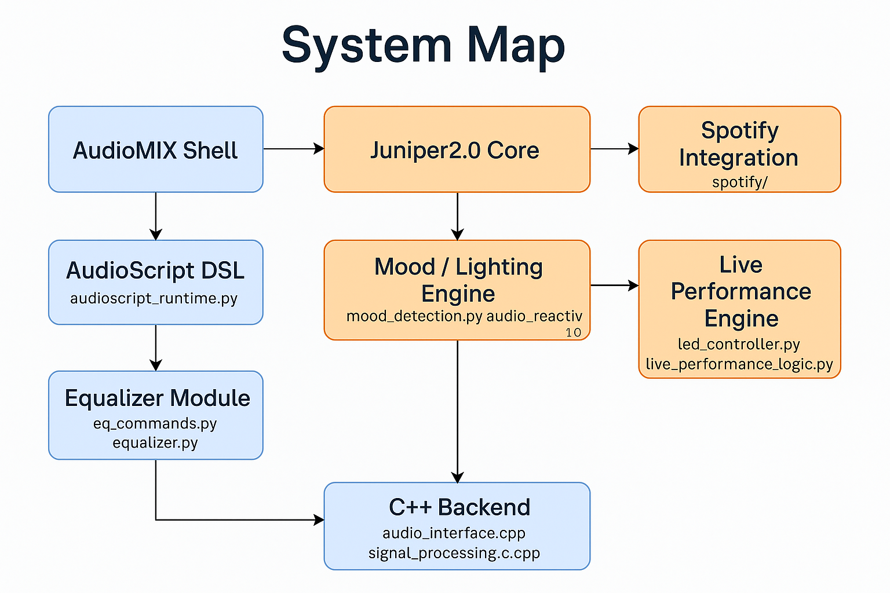

# 🎧  AudioMIX - AI-Assisted Music Production & Live Performance Software


**AudioMIX** is an open-source artist-friendly audio platform designed for independent artists, producers, and developers. **AudioMIX** combines AI-driven audio analysis, real-time audio processing and live performance control into a unified creative system.
Spotibot was its original name..

> Modular, expressive, and built for real-time creative performance.

I update this repo continuously via my local terminal. :) <3

Current Stars ✨: 0 :(

*A moment of silence for the stars and fork lost during the "Great Private Repo Panic" of 2026. If you like what you see, help me rebuild the count! I promise to not touch the 'Private' button again.*

---

## AudioMIX Core Features

- Real-time DSP audio engine in C++
- AudioScript (custom musical programming DSL) for live coding features
- Mood detection from audio files with ML-based tagging
- Spectral, MFCC, beat tracking, and tempo analysis
- Integrated Spotify API for playlist input with room for future extensions
- LED output logic for physical interaction
- **Live performance engine** for visual show control
- **Audience listener** to hype up live performances based on audience input
- **AudioScript Shell** for live coding features
- **CLI-parseable JSON output** for mood + BPM classification
- Provides a foundation for AI-assisted music production

---

## Ethical AI

**AudioMIX** follows an open-source, emotionally-aware, and artist-first development philosophy.  
See [ETHICAL_AI_MANIFESTO.md](./ETHICAL_AI_MANIFESTO.md) for our creative mission and guiding principles.

---

## License

GNU General Public License v3 (open-source and free to use for independent artists and developers, please refer to [LICENSE.txt](./LICENSE.txt))

---

## Project Modules

**AudioMIX** is modular by design, allowing for rapid extension into a full-scale music AI and production framework. The system will be organized into the following key components:

### 1. `audio/`

**Purpose:** real-time DSP audio engine and feature extraction from audio files
**Current Capabilities:**

- Mel-frequency cepstral coefficients (MFCC)
- Spectral contrast
- Tempo + beat tracking
- Dynamic range + loudness modeling
**Future Expansion:**
- Key detection
- Genre classification

---

### 2. `performance-engine/`

**Purpose:** Real-time control and exection
**Current Capabilities:**

- Audience listener
- EQ settings
- MIDI player (in dev)
- AudioScript runtime shell for live coding performances
- Python modules for AI/ML
**Future Expansion:**
- Hardware capabilities

---

### 3. `led-service/`

**Purpose:** LED control microservice for live color pattern output based on mood/BPM JSON input  
**Current Capabilities:**

- CLI-parseable JSON endpoint (e.g. `python main.py '{"mood": "hype", "bpm": 135}'`)
- Pattern selection (strobe, pulse, fade)
- Mood → RGB mapping with custom color profiles  
**Future Expansion:**
- Socket-based live trigger events
- DMX lighting integration for venue-scale output

---

### 4. `audio_providers/`

**Purpose:** External integrations and ethical API Use

**No Scraping Data:**

- This project interacts with Spotify through the **official Spotify Web API**, utilizing authenticated access and approved scopes.
- No scraping is used at any point.
- All audio feature extraction is handled through permitted endpoints provided by Spotify, in accordance with their [Developer Terms of Service](https://developer.spotify.com/terms).
- This ensures ethical, transparent, and respectful use of artist and user data.
- Includes Bandcamp embed

> The purpose of these features is to support creative analysis and mood-based musical applications—not to exploit or misrepresent Spotify’s platform.

---

### 5. `datasets/`

**Purpose:** Audio files, metadata, and ML training targets
**Current Format:**

- Metadata syncing with Spotify API
- Manual labeling for mood, BPM, genre
- JSON parsing logic per track
**Future Expansion:**
- CSV per track
- Open contributor mood tag dataset
- Dataset visualizer UI

---

## AudioScript - The Language of AudioMIX

**AudioScript** is a custom musical programming domain-specific language (DSL) created for **AudioMIX.** It allows users to control audio playback, LED behaviors, and mood transitions using expressive, scriptable commands in high-level syntax.

---

### AudioScript (AS) Features

- Human-readable, whitespace-sensitive syntax
- Modular commands: `play()`, `glow()`, `pulse()`, `mood.set()`, and more
- CLI interpreter support with real-time execution
- Designed for live performance, emotional scripting, and AI augmentation
- Influences of Python, C++, and Haskell

### Sample Script

```python
mood.set("uplifted")
glow("lilac")
play("intro.wav")
pulse("yellow", bpm=120)
```

> More can be found in the `audioscript/` directory
**AudioScript** is still evolving. View the full language spec here: [AUDIOSCRIPT_SPEC.md](./AUDIOSCRIPT_SPEC.md)

---

## Juniper2.0 – The AudioMIX AI Core

**Juniper2.0** is the intelligent assistant inside AudioMIX, designed to:

- Assist with **AudioScript** generation and debugging
- Suggest mood-optimized track flows and EQ settings
- Recommend LED and emotional mappings
- Guide live creative workflows in real time

**Juniper2.0** will be integrated into the CLI and future UI to provide intelligent inline suggestions and personalized creative support for musicians and coders alike.

> Juniper doesn’t replace the artist—she collaborates with them.

---

## System Architecture Map

Below is the current system-level architecture of **AudioMIX,** including modules written in *Python*, *C++,* and *AudioScript:*
**AudioMIX will rave. Thank you :)**



### Project Tree

A full snapshot of the current project structure can be found in [`AudioMIX_project_tree.txt`](docs/AudioMIX_project_tree.txt).

---

## 🖥️  AudioMIX-Electron — Official Desktop Interface

**AudioMIX-Electron** is the companion desktop UI for the **AudioMIX Core Engine.**
It provides a secure, dynamic, and visually reactive front-end built with Electron v39 and Node 22, designed to emulate the clean utility of VS Code while introducing DAW-style elements such as mixers, EQ panels, and LED feedback zones.

> 💡 Status: Actively in development — currently at the “First Breath” milestone (v0.1-dev).

### Repository

[AudioMIX-Electron on GitHub](https://github.com/alexisvassquez/audiomix-electron)

### AudioMIX-Electron Features

- Secure sandboxed Electron shell (context isolation, no Node exposure)
- Real-time backend heartbeat and system status bar
- Modular UI framework ready for EQ, Mixer, and LED visualization panels
- Full-screen responsive layout with universal keyboard-friendly controls
- Preload bridge for safe IPC between renderer and backend (FastAPI / C++)

| Layer           | Repository                                                               | Purpose                                                        |
| :-------------- | :----------------------------------------------------------------------- | :------------------------------------------------------------- |
| **Core Engine** | [`AudioMIX`](https://github.com/alexisvassquez/ai_spotibot_player) | Backend DSP, AI, and system logic.                |
| **Desktop UI**  | [`AudioMIX-Electron`](https://github.com/alexisvassquez/audiomix-electron) | Visual front-end shell for artists, producers, and developers. |

Once the FastAPI bridge is live, the Electron client will automatically surface real-time system info from the AudioMIX backend.

---

## Dependencies

AudioMIX is a hybrid Python + native audio platform. It relies on both Python packages and system-level audio/build tools.

### Requirements

Python requirements are listed in `requirements.txt` and can be installed via the instructions below:

- Python 3.10+
- CMake 3.18+
- librosa, scikitlearn, sounddevice (please refer to requirements.txt)
- PortAudio or PulseAudio

### Getting Started

```bash
git clone https://github.com/alexisvassquez/ai_spotibot_player.git
cd ai_spotibot_player
pip install -r requirements.txt
mkdir build && cd build
cmake ..
make
```

### UI Preview

```bash
git clone https://github.com/alexisvassquez/audiomix-electron.git
cd audiomix-electron
npm install
npm start
```

---

© Alexis M Vasquez 2026, Software Engineer / AMV Digital Studios
